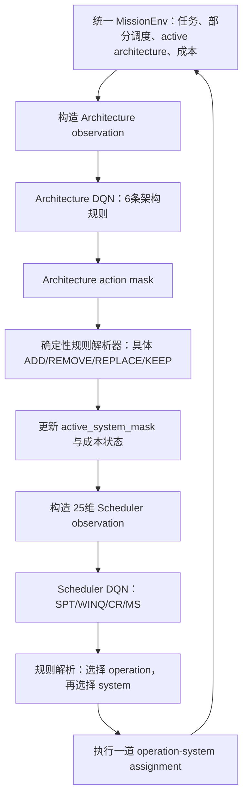

# 基于规则抽象的同频双层深度强化学习体系演化与任务调度方法

> 本文档为论文“方法”章节草稿，内容严格对应当前代码实现。为避免伪造文献，文中暂不生成具体参考文献条目；正式投稿时应补充体系架构选择、基于调度规则的深度强化学习、分层强化学习与动作掩码等相关工作引用。

## 1. 问题描述

### 1.1 任务、操作与候选系统

给定一个由 (T) 个任务组成的 mission：

\[
\mathcal{M}=\{\tau_1,\tau_2,\ldots,\tau_T\}.
\]

每个任务 \(\tau_i\) 包含按固定先后关系执行的 \(O\) 道 operation：

\[
\tau_i=(o_{i,1},o_{i,2},\ldots,o_{i,O}).
\]

operation \(o_{i,j}\) 具有能力类型 \(g_{i,j}\)、持续时间 \(p_{i,j}\) 和释放时间 \(r_{i,j}\)。同一任务中的 operation 满足前序约束：

\[
s_{i,j+1}\ge f_{i,j},\qquad
f_{i,j}=s_{i,j}+p_{i,j},
\]

其中，\(s_{i,j}\) 和 \(f_{i,j}\) 分别表示开始和完成时间。

候选系统全集为

\[
\mathcal{S}=\{S_1,S_2,\ldots,S_N\}.
\]

每个系统 \(S_k\) 具有能力类型 \(g_k\)、成本 \(c_k\) 和可用时间窗 \([l_k,u_k]\)。operation 只能分配给能力匹配的系统：

\[
x_{i,j,k}=1\Rightarrow g_{i,j}=g_k,
\]

并且必须在该系统的可用时间窗内完成：

\[
x_{i,j,k}=1\Rightarrow l_k\le s_{i,j}<f_{i,j}\le u_k.
\]

每道 operation 仅被分配一次；同一系统同一时刻最多执行一道 operation。环境通过维护系统最早可用时间 \(q_k\) 来保证资源互斥。若将 \(o_{i,j}\) 分配给 \(S_k\)，则

\[
s_{i,j}=\max(q_k,r_{i,j},f_{i,j-1}),\qquad
q_k\leftarrow f_{i,j}.
\]

mission 的完工时间（makespan）定义为

\[
C_{\max}=\max_{i,j} f_{i,j}.
\]

### 1.2 动态体系架构

时刻 \(t\) 的体系架构表示为候选系统全集上的二进制向量：

\[
\mathbf{z}_t=(z_{1,t},z_{2,t},\ldots,z_{N,t}),\qquad
z_{k,t}\in\{0,1\},
\]

其中 \(z_{k,t}=1\) 表示系统 \(S_k\) 当前处于 active 状态，可以承担后续尚未排定的 operation。与一次性静态 architecture selection 不同，本文允许 \(\mathbf{z}_t\) 在同一 mission 的离线调度构造过程中发生变化。

本文中的“决策步”不是物理时间推进事件，而是离线方案构造过程中的一次尾部追加：每一步先决定是否调整体系，再确定一道 operation 的系统分配。已经排定的 operation 永不回滚；系统退出只影响未来分配，历史开始时间、完成时间和资源占用记录均被保留。

### 1.3 优化目标

本问题同时关注任务完成、makespan 和体系成本。下层调度策略直接以降低 makespan 为目标；上层体系策略直接承担净成本与预算控制，同时通过 makespan 增量和终止反馈避免为了节省成本而破坏任务可行性与执行效率。

因此，本文当前实现是带预算软约束的标量化多目标强化学习，而不是显式 Pareto 前沿搜索或严格约束马尔可夫决策过程。预算违规不会被硬动作掩码禁止，而是通过二次惩罚进入上层奖励。

## 2. 同频双层分层强化学习框架

### 2.1 层次化策略分解

若直接将“体系调整”和“operation-system 分配”组合为一个扁平动作，则动作规模随候选系统数、任务数和 operation 数快速增长。本文不训练一个覆盖全部联合动作的网络，而是将联合策略条件分解为

\[
\pi(a_t^A,a_t^S\mid s_t)
=
\pi_A(a_t^A\mid s_t^A)
\pi_S(a_t^S\mid s_t^S,\mathbf{z}_t^+),
\]

其中：

- \(\pi_A\) 为 Architecture DQN，选择体系调整规则 \(a_t^A\)；
- \(\mathbf{z}_t^+=F(\mathbf{z}_t,a_t^A)\) 为执行上层动作后的 active system mask；
- \(\pi_S\) 为 Scheduler DQN，在更新后的体系下选择调度规则 \(a_t^S\)；
- 调度规则进一步确定具体的 \((o_{i,j},S_k)\) 分配。

因此，一个完整构造步的状态转移为

\[
\mathbf{z}_t^+=F(\mathbf{z}_t,a_t^A),
\]

\[
x_t=G(s_t^S,\mathbf{z}_t^+,a_t^S),
\]

\[
s_{t+1}=P(s_t,\mathbf{z}_t^+,x_t).
\]

该结构只有两个策略网络。每个策略对应一个单输出头；各自的 target network 仅用于稳定时序差分学习，不构成额外的决策策略。

### 2.2 与经典 options HRL 的区别

本文方法属于基于策略分解和动作抽象的同频双层 HRL。上层动作会改变下层动作的可行集合，因此两个层次具有明确的条件依赖和决策抽象关系。但是，上层在每个调度构造步都被调用，`KEEP` 表示本步不调整体系；本文没有额外的 option termination network，也没有人为设定固定的粗、细时间尺度。因此，该方法不是一个高层 option 持续多个低层动作的经典半马尔可夫 options 模型，而是一个每步串行执行“体系调整—任务调度”的 intra-step hierarchy。

### 2.3 单环境交互流程



两层共享同一个 `MissionEnv`，不存在两个相互复制的环境。环境同时保存任务进度、历史调度、系统 ready time、体系 active mask 和累计成本，因而上层变化会立即约束本步下层的可行动作。

## 3. 自适应体系调度环境

### 3.1 环境状态

环境维护以下核心状态：

- `initial_system_mask`：episode 初始体系；
- `active_system_mask`：当前允许承担未来 operation 的系统；
- `used_system_mask`：系统是否曾承担过 operation；
- `system_ready_time`：各系统完成历史任务后的最早可用时间；
- `task_op_idx`：每个任务下一道待排 operation 的索引；
- `op_assign_sys`、`op_start_time`、`op_finish_time`：历史分配记录；
- `current_makespan`：当前部分调度的 makespan；
- `net_cost`、`active_cost` 和 `total_refund`：体系成本状态；
- `architecture_change_count` 和 `steps_since_change`：体系变化统计。

环境的底层原始 assignment action 编码为

\[
a^{env}=((i\cdot O)+j)\cdot N+k,
\]

其理论规模为 \(T O N\)。该动作空间只作为确定性规则解析后的执行接口，两个 DQN 均不直接输出该高维动作。

### 3.2 动态成本模型

episode 初始净成本为

\[
C_0=\sum_{k=1}^{N} z_{k,0}c_k.
\]

设退款比例为 \(\rho\)，当前实现取 \(\rho=0.8\)。体系动作的净成本变化为

\[
\Delta C_t=
\begin{cases}
0, & \text{KEEP},\\
c_k, & \text{ADD}(S_k),\\
-\rho c_k, & \text{REMOVE}(S_k),\\
c_{new}-\rho c_{old}, & \text{REPLACE}(S_{old},S_{new}).
\end{cases}
\]

净成本按下式更新：

\[
C_{t+1}=\max(0,C_t+\Delta C_t).
\]

系统退出后若再次加入，需要重新支付 100% 系统成本；因此一次完整的 ADD-REMOVE 循环产生 \((1-\rho)c_k=0.2c_k\) 的净损失，不存在正向成本套利。重新加入不会清除该系统过去的 ready time 和已执行记录。`active_cost` 表示当前 active systems 的成本之和，仅用于观测与统计；`net_cost` 才是奖励中的成本变量。

需要强调的是，该模型将退出退款解释为可回收价值。如果应用中的成本是不可回收采购成本，则应同时报告累计投入、累计退款和净成本，或重新设定 \(\rho\)。

### 3.3 可行性、动作掩码与 dead end

对任务 \(i\) 当前待排 operation \(j_i\)，若系统 \(S_k\) 同时满足以下条件，则 assignment 可行：

1. \(S_k\) 当前 active；
2. \(g_{i,j_i}=g_k\)；
3. operation 的最早完成时间不超过 \(u_k\)。

环境分别计算：

- active architecture 下的 `assignment_mask`；
- 将候选池全部激活时的 `global_assignment_mask`。

若 active architecture 当前无可行 assignment，但完整候选池能够提供可行 assignment，则该状态被标记为 `needs_architecture_change`，而不是 dead end。此时 `KEEP` 被掩码，Architecture DQN 必须从可行的救援规则中选择。只有 mission 尚未完成且完整候选池对当前所有待排 operation 都无能为力时，才判定真正 dead end：

\[
d_t^{dead}=\mathbb{I}
\left[
\neg success_t
\land
\sum global\_assignment\_mask_t=0
\right].
\]

这一设计保证“当前体系不可行”与“候选资源全集不可行”不会被混为一谈。

## 4. Architecture DQN

### 4.1 上层观测

Architecture DQN 的观测由调度摘要、体系状态、能力压力与成本进度共同组成：

\[
s_t^A=
[s_t^S,\mathbf{z}_t,\mathbf{u}_t,\mathbf{q}_t,
\mathbf{f}_t,\mathbf{c}_t].
\]

当前候选系统数 \(N=22\)，能力类型数 \(F=3\)，因此 Architecture observation 的维度为

\[
d_A=25+3N+5F+6=112.
\]

| 观测组 | 维度 | 内容 |
|---|---:|---|
| 调度状态 | 25 | 下层 Scheduler 的完整状态摘要 |
| active mask | 22 | 每个候选系统是否处于 active 状态 |
| used mask | 22 | 每个候选系统是否承担过 operation |
| ready time | 22 | 系统 ready time，以 mission 总 processing time 归一化 |
| 能力类型特征 | 15 | 每种能力的剩余需求、剩余容量、inactive 候选比例、阻塞率和利用率 |
| 全局标量 | 6 | 完成进度、当前 makespan、active cost、net cost、超预算比例和距上次变更步数 |

对每种能力类型 \(g\)，五个类型特征分别为

\[
\left[
\frac{D_g^{rem}}{M_{ref}},
\frac{K_g^{rem}}{M_{ref}},
\frac{N_g^{inactive}}{N},
\frac{N_g^{blocked}}{\max(N_g^{ready},1)},
\frac{B_g}{\max(B_g+I_g,1)}
\right],
\]

其中 \(D_g^{rem}\) 为剩余 operation duration，\(K_g^{rem}\) 为 active systems 的剩余时间窗容量，\(B_g\) 和 \(I_g\) 分别为累计 busy time 与 idle time。归一化基准

\[
M_{ref}=\sum_{i=1}^{T}\sum_{j=1}^{O}p_{i,j}.
\]

### 4.2 上层规则动作空间

Architecture DQN 的单输出头固定包含 6 个规则动作。网络只选择规则类型，确定性解析器再将规则映射为具体系统索引。

| 编号 | 动作 | 规则语义与确定性解析 |
|---:|---|---|
| 0 | `KEEP` | 当前 active architecture 存在可行 assignment 时保持不变；否则动作无效并被掩码。 |
| 1 | `ADD_CAPABILITY` | 对当前 ready operation 中 active systems 完全缺失的能力类型，从 inactive systems 中选择能够完成该 operation 的系统；按预计完成时间、成本和系统索引升序确定。 |
| 2 | `ADD_CAPACITY` | 计算各能力类型的剩余需求/剩余容量压力，优先扩充压力最大的类型；类型内部优先选择剩余容量最大、成本最低、索引最小的系统。 |
| 3 | `ADD_WINDOW` | 针对能力类型已存在但因时间窗而阻塞的 ready operation，加入能够最早完成该 operation 的 inactive system；随后按成本和索引打破平局。 |
| 4 | `REMOVE_REDUNDANT` | 仅考虑移除后仍覆盖各能力剩余需求容量、且当前仍存在可行 assignment 的系统；优先选择退款最高者，同退款下优先移除未使用系统，再按索引确定。 |
| 5 | `REPLACE_INEFFICIENT` | 在相同能力类型内执行原子 REMOVE+ADD。候选必须维持当前可行性，且综合价值 \(v>0\)；选择价值最高的替换。 |

替换动作的综合价值定义为

\[
v=
\frac{\bar f_{current}-\bar f_{new}}{M_{ref}}
-
\frac{c_{new}-\rho c_{old}}{B},
\]

其中 \(\bar f\) 为当前 ready operations 的平均最早完成时间，\(B\) 为预算。只有 \(v>0\) 的替换才进入候选集。`REPLACE_INEFFICIENT` 在统计上被视为一次体系变化。

解析器在每个环境决策版本上缓存 6 个规则的模拟结果。只有实际增删系统或排定 operation 后才递增版本号并使缓存失效，从而避免同一状态下为动作掩码和动作执行重复计算规则。

### 4.3 上层奖励

预算势函数定义为

\[
\Phi(C)=20\left[\max\left(0,\frac{C}{B}-1\right)\right]^2.
\]

Architecture DQN 的原始一步奖励为

\[
r_t^A=
-10\frac{\Delta C_{\max,t}}{M_{ref}}
-\frac{\Delta C_t}{B}
-\left[\Phi(C_{t+1})-\Phi(C_t)\right]
-0.01\mathbb{I}(a_t^A\ne KEEP)
r_t^{term},
\]

其中

\[
\Delta C_{\max,t}=C_{\max,t+1}-C_{\max,t},
\qquad
\Delta C_t=C_{t+1}-C_t,
\]

终止项为

\[
r_t^{term}=
\begin{cases}
+1, & \text{mission success},\\
-2, & \text{dead end},\\
0, & \text{otherwise}.
\end{cases}
\]

各项均经过 \(M_{ref}\) 或预算 \(B\) 归一化。REMOVE 会使 \(\Delta C_t<0\)，因而产生正向成本反馈；重复增删仍因 20% 净损失和变更惩罚受到抑制。预算项为软二次惩罚，在 \(C\le B\) 时为零，超预算程度越大，边际惩罚越强。

从职责上看，上层直接感知并优化成本与预算，下层不接收成本奖励；但当前上层 makespan 系数为 10，因此 makespan 仍是具有实质影响的辅助目标，而不是可以忽略的微小正则项。

## 5. Scheduler DQN

### 5.1 25维调度观测

Scheduler DQN 沿用与原静态环境兼容的 25 维观测。该设计使已有 Scheduler checkpoint 可以直接用于动态体系环境。

| 索引 | 特征组 | 具体统计量 |
|---:|---|---|
| 1--3 | 任务状态比例 | 未完成任务、当前可调度任务、等待任务占比 |
| 4--6 | 当前 operation duration | 候选 operation duration 的和、均值、最小值，均除以 \(M_{ref}\) |
| 7--9 | 剩余工作量 | 候选任务剩余 duration 的和、均值、最大值 |
| 10--11 | 后续能力负载 | 候选任务 next-type load 的均值、最小值 |
| 12--13 | 到期时间裕度 | time-to-due 的均值、最小值 |
| 14--16 | slack | 候选 slack 均值、最小值，以及等待任务最小 slack |
| 17 | 系统延迟 | active systems 相对当前调度前沿的平均 ready delay |
| 18 | 任务进度 | 各任务 operation 完成比例的均值 |
| 19--20 | 风险比例 | time-to-due 小于 0、slack 小于 0 的候选比例 |
| 21--25 | 离散程度 | duration、剩余工作量、time-to-due、slack、next-type load 的变异系数 |

### 5.2 调度规则动作空间

Scheduler DQN 的输出动作不是具体 operation 或系统，而是 4 种调度规则：

| 编号 | 规则 | operation 选择指标 |
|---:|---|---|
| 0 | SPT | 最短当前处理时间 \(p_{i,j}\) |
| 1 | WINQ | 最小 next-type load |
| 2 | CR | 最小 \(\mathrm{TTD}_{i}/\max(R_i,1)\) |
| 3 | MS | 最小 slack |

规则首先在所有当前可行的任务前沿 operation 中选择一个 operation。若主指标相同，则依次按最早开始时间、任务索引和 operation 索引打破平局。

确定 operation 后，系统选择采用一致的 CSSA 规则。对所有可行系统，按以下字典序选择最优系统：

\[
(s_{i,j,k},f_{i,j,k},busy_k,k).
\]

即依次优先最早开始、最早完成、累计 busy time 最小和系统索引最小。这样，Scheduler DQN 的动作规模固定为 4，而具体 operation-system 分配仍由环境状态和确定性规则共同产生。

### 5.3 下层奖励

环境产生的基础调度奖励为归一化负 makespan 增量：

\[
r_t^{S,base}=-\frac{C_{\max,t+1}-C_{\max,t}}{M_{ref}}.
\]

Scheduler 单独预训练时使用该基础奖励。在双层运行和联合微调阶段，下层额外共享终止反馈：

\[
r_t^S=r_t^{S,base}+r_t^{term}.
\]

因此，下层直接学习控制 makespan，同时对完整完成 mission 和不可恢复失败进行区分。

## 6. 网络结构与价值学习

### 6.1 网络结构

两个策略网络均采用两层全连接多层感知机：

\[
Q(s;\theta)=W_3\,\sigma(W_2\,\sigma(W_1s+b_1)+b_2)+b_3,
\]

其中 \(\sigma(\cdot)\) 为 ReLU。当前实验使用的具体结构为：

| 网络 | 输入 | 隐藏层 | 输出 | 可训练参数量 |
|---|---:|---:|---:|---:|
| Architecture DQN | 112 | 128--128 | 6 | 31,750 |
| Scheduler DQN | 25 | 128--128 | 4 | 20,356 |

每个在线网络均对应一个结构相同的 target network。无效动作在选择和 bootstrap 时均被赋值为 \(-10^9\)，从而实现 masked DQN：

\[
a_t=\arg\max_{a:m_t(a)=1}Q(s_t,a;\theta).
\]

探索阶段使用带掩码的 \(\epsilon\)-greedy 策略，仅从有效动作中随机采样。

### 6.2 Scheduler 一步 Replay

Scheduler replay 存储

\[
(s_t^S,a_t^S,r_t^S,s_{t+1}^S,d_t,m_{t+1}^S).
\]

其目标值为

\[
y_t^S=r_t^S+gamma(1-d_t)
\max_{a:m_{t+1}^S(a)=1}Q_S^-(s_{t+1}^S,a).
\]

当下一状态无有效动作时，bootstrap 项置零。

在双层环境中，下一次 Scheduler 决策发生在下一次 Architecture action 执行之后。由于该上层动作可能改变 active system mask，当前 Scheduler transition 不能立即使用 operation 执行后的状态作为 \(s_{t+1}^S\)。实现中先将 transition 暂存；进入下一构造步、执行上层动作并重新生成调度观测和 action mask 后，才补全该 transition。若 episode 已终止，则直接以终止状态和全零 mask 入库。

### 6.3 Architecture 五步 Replay

Architecture DQN 使用独立的 5-step replay。原始 transition 为

\[
(s_t^A,a_t^A,r_t^A,s_{t+1}^A,d_t,m_{t+1}^A).
\]

对实际经历的 \(k\le5\) 步，累计回报为

\[
R_t^{(k)}=\sum_{j=0}^{k-1}\gamma^jr_{t+j}^A.
\]

buffer 存储

\[
(s_t^A,a_t^A,R_t^{(k)},s_{t+k}^A,d_{t+k-1},m_{t+k}^A,\gamma^k).
\]

目标值为

\[
y_t^A=R_t^{(k)}+gamma^k(1-d_{t+k-1})
\max_{a:m_{t+k}^A(a)=1}Q_A^-(s_{t+k}^A,a).
\]

episode 提前结束时，累积器会依次刷新剩余的 1--4 步 transition，确保终止奖励可以进入所有尚未发射的回报。

### 6.4 参数更新

两个网络均最小化均方 TD 误差：

\[
\mathcal{L}(\theta)=
\frac{1}{|\mathcal{B}|}
\sum_{(s,a,y)\in\mathcal{B}}
\left(Q(s,a;\theta)-y\right)^2.
\]

优化器为 Adam，batch size 为 64，折扣因子 \(\gamma=0.99\)。梯度二范数裁剪阈值为 10；每 100 次学习更新将在线网络参数硬复制到 target network。Replay 采用均匀随机采样。

## 7. 分阶段训练方法

### 7.1 阶段一：Scheduler 预训练

首先在静态可行体系上训练 Scheduler DQN，使其学习在给定 architecture 下选择 SPT、WINQ、CR 或 MS。该阶段 Architecture 不变化，Scheduler replay 使用普通一步 transition。

当前 seed 4 结果使用的 Scheduler checkpoint 训练设置为：1000 个 episode、一个固定 mission 和一个包含 15 个系统的静态可行体系、学习率 \(10^{-3}\)、buffer size 10,000、最小 buffer 500、隐藏层宽度 128。\(\epsilon\) 从 1.0 按每 episode 乘 0.995 衰减，最低为 0.05。

该设置可以验证下层在固定场景中的收敛，但不能单独证明跨 mission 和跨 architecture 的泛化能力。若论文需要将 Scheduler 泛化作为独立结论，应进一步使用多 mission、多可行 architecture 的预训练场景池进行对照实验。

### 7.2 阶段二：冻结 Scheduler 训练 Architecture

加载 Scheduler checkpoint 并冻结其参数。在每个构造步中，Architecture DQN 先选择架构规则，冻结的 Scheduler 以 \(\epsilon_S=0\) 选择调度规则并执行一道 operation。Architecture DQN 每步从自身 5-step replay 更新一次；Scheduler 可以记录交互 transition，但该阶段不进行梯度更新。

Architecture 训练采用动态初始体系课程。首先采样一个成本不超过预算、能够覆盖 mission 能力和总容量需求的可行体系，然后按以下比例构造缺陷初始体系：

| 场景类别 | 权重 | 构造方式 |
|---|---:|---|
| 可行但非最优 | 50% | 在可行体系中随机加入一个 inactive system |
| 容量紧张 | 20% | 每种能力仅保留一个时间窗容量较小的系统 |
| 缺少能力 | 15% | 删除 mission 首道 operation 所需能力类型的所有系统 |
| 冗余或超预算 | 15% | 加入两个成本最高的 inactive systems |

当前 seed 4 Architecture checkpoint 使用 100 个训练场景、1000 个 episode、学习率 \(10^{-4}\)、5-step return、buffer size 50,000、最小 buffer 500、隐藏层宽度 128、预算 \(B=8000\) 和退款比例 \(\rho=0.8\)。探索参数同样从 1.0 衰减至 0.05。

### 7.3 阶段三：可选交替微调

为降低两个独立预训练策略之间的分布偏移，系统提供可选的交替微调阶段。以 10 个 episode 为一个周期：

- 前 8 个 episode 仅更新 Architecture DQN；
- 后 2 个 episode 仅更新 Scheduler DQN；
- 未更新的网络仍参与决策，但参数冻结；
- Scheduler 微调学习率为 \(10^{-5}\)。

两个网络不在同一 episode 同时更新，从而降低非平稳性。需要说明的是，本文当前 seed 4 的 100-mission 结果使用阶段二结束后的组合 checkpoint，Scheduler 在 Architecture 训练阶段保持冻结，并未采用阶段三微调结果。

### 7.4 训练伪代码

```text
Algorithm 1  Frozen-Scheduler Architecture Training
Input: scenario pool D, pretrained Scheduler Q_S,
       Architecture online/target networks Q_A and Q_A^-,
       architecture replay B_A, n-step accumulator U

for episode = 1 ... E do
    sample (initial architecture A_0, mission M) from D
    initialize the single adaptive MissionEnv
    clear U

    while mission is not terminal do
        construct upper observation s_A and architecture mask m_A
        if m_A has no valid action then terminate as dead end

        choose architecture rule a_A using masked epsilon-greedy Q_A
        apply deterministic architecture resolver
        update active systems and cost state

        construct scheduler observation s_S and mask m_S
        complete the previous pending Scheduler transition using (s_S, m_S)
        if m_S has no valid action then
            assign dead-end reward to Architecture and terminate

        choose scheduling rule a_S greedily using frozen Q_S
        resolve a_S into one concrete operation-system assignment
        execute the assignment in MissionEnv

        compute r_A and r_S
        append the upper transition to U
        emit available 5-step transitions into B_A
        sample a minibatch from B_A and update Q_A
        periodically synchronize Q_A^- <- Q_A
    end while

    flush all remaining short n-step transitions when terminal
    decay architecture epsilon
end for
```

## 8. 推理过程

测试时两个策略均使用 \(\epsilon=0\)，不进行网络更新，也不写 replay。一次 mission 的推理过程如下：

1. 使用给定初始 architecture 初始化统一环境；
2. 生成 112 维上层观测和 6 维 architecture action mask；
3. Architecture DQN 在有效规则中选择 Q 值最大的动作；
4. 确定性解析器更新 active system mask 和成本；
5. 生成 25 维调度观测；
6. Scheduler DQN 选择一个调度规则；
7. 调度规则确定 operation，CSSA 确定 system；
8. 环境执行该 assignment，并更新任务进度、system ready time、makespan 和可行性；
9. 重复步骤 2--8，直至所有 operation 完成或完整候选池也无法解救。

单个 episode 的安全步数上限设置为 \(TO+N\)。在正常情况下，每个构造步都会完成一道 operation，因此 mission 在 \(TO\) 步内完成。

## 9. 实验评价协议

### 9.1 配对测试

测试集使用未参与训练的 mission seeds 构造。所有待比较方法共享完全相同的 mission 和初始 architecture；每个场景由 architecture 索引、任务释放/到期时间以及各 operation 的能力类型、持续时间和释放时间生成 SHA-256 hash，以保证逐场景配对复现。

主要指标包括：

- mission success rate；
- 成功 mission 的 makespan；
- net cost、active cost 和 total refund；
- budget violation rate；
- architecture change count；
- 两层规则动作计数。

由于失败 mission 的部分 makespan 不等价于完整任务 makespan，总体对比中的 `mean_success_makespan` 只对成功样本计算；成功率必须与该指标同时报告，避免失败方法因只保留容易样本而获得表面上较好的 makespan。

### 9.2 对比方法

当前评估入口支持以下方法：

1. **Static initial architecture + Scheduler DQN**：不允许体系变化；
2. **Full-system reference**：激活所有候选系统并使用同一 Scheduler DQN；这是资源充分参考，不是数学最优调度上界；
3. **Fixed architecture rules**：有可行 assignment 时始终 KEEP，否则选择编号最小的可行救援规则；
4. **Random architecture rules**：在有效架构规则中随机选择；
5. **Flat IntDQN（可选）**：直接从扁平联合决策空间选择动作；
6. **Proposed two-level HRL**：Architecture DQN 与 Scheduler DQN 均采用贪心策略。

## 10. 动作空间与计算复杂度

若直接输出 operation-system assignment，底层原始动作规模为 \(TO N\)；若再与体系增删组合，联合动作规模还会继续扩大。本文两个网络的输出维度固定为 6 和 4，从网络学习角度将高维组合动作转化为常数规模的规则选择。

规则解析仍需要在候选系统和当前任务前沿上搜索：

- ADD 类规则主要扫描 ready operations 与 inactive systems；
- REMOVE 需要对 active systems 逐一模拟剩余能力和容量覆盖；
- REPLACE 最坏情况下扫描相同能力类型的 active-inactive system 对。

因此，动作抽象减少的是神经网络输出与探索空间，而不是消除全部组合搜索。实现通过按 `decision_version` 缓存同一状态下的 6 条规则解析结果，避免动作掩码、动作选择和执行阶段的重复模拟。

## 11. 方法边界

为保证论文结论与实现一致，需要明确以下边界：

1. **HRL 类型**：本文是同频、条件分解的双层 HRL，不包含持续多步的 option 或第三个触发网络。
2. **策略数量**：系统只有 Architecture DQN 和 Scheduler DQN 两个决策策略；target networks 不计为独立 agent。
3. **Architecture Agent 唯一性**：增、删、替换和保持均由同一个 6 动作单输出头选择，不拆分为多个 architecture 输出头。
4. **规则抽象**：两个 DQN 学习的是“何时选择哪条规则”，而不是端到端直接输出具体系统或 assignment。
5. **预算性质**：当前预算是软约束；零预算违规是训练得到的经验结果，而不是由硬约束保证。
6. **成本语义**：80% 退款是显式建模假设。若退出系统不存在可回收价值，需修改成本模型并重新训练。
7. **调度历史**：体系变化不回滚已经排定的 operation，适用于增量构造离线方案的语义。
8. **多目标性质**：当前使用固定权重标量奖励，不直接生成 Pareto 前沿；若需要严格满足 \(C\le B\)，可进一步采用拉格朗日约束更新或硬预算 action mask。
9. **泛化范围**：当前 Scheduler checkpoint 在单一静态 mission 上预训练。完整方法能够接受多 mission 预训练，但现有 checkpoint 的泛化结论仍需通过多场景 Scheduler 对照实验加强。

## 12. 当前实验超参数汇总

| 参数 | Scheduler 预训练 | Architecture 训练 | 可选联合微调 |
|---|---:|---:|---:|
| Episodes | 1000 | 1000 | 用户设定 |
| Scenario pool size | 1 | 100 | 用户设定 |
| Hidden dimensions | 128--128 | 128--128 | 沿用 checkpoint |
| Learning rate | \(10^{-3}\) | \(10^{-4}\) | Scheduler \(10^{-5}\) |
| Discount \(\gamma\) | 0.99 | 0.99 | 0.99 |
| Replay capacity | 10,000 | 50,000 | 由配置指定 |
| Minimum replay | 500 | 500 | 500 |
| Batch size | 64 | 64 | 64 |
| Target update interval | 100 | 100 | 100 |
| N-step | 1 | 5 | Architecture 5 / Scheduler 1 |
| \(\epsilon_0\) | 1.0 | 1.0 | 0.05 |
| \(\epsilon_{min}\) | 0.05 | 0.05 | 0.05 |
| Decay | 0.995/episode | 0.995/episode | 固定 |
| Budget \(B\) | 8000 | 8000 | 8000 |
| Refund rate \(\rho\) | 不适用 | 0.8 | 0.8 |
| Budget potential coefficient | 不适用 | 20 | 20 |
| Gradient clipping | 10 | 10 | 10 |

当前仿真配置包含 22 个候选系统和 3 种能力类型。每个 mission 包含 30 个任务，每个任务包含 4 道 operation，共 120 道 operation；operation duration 从 \([20,30]\) 的整数区间采样，三种能力的采样权重为 0.3、0.4 和 0.3，到期时间紧度从 \([1,3]\) 区间采样。上述配置属于当前实验实例，不限制方法在其他任务规模和能力类型数量上的使用。
