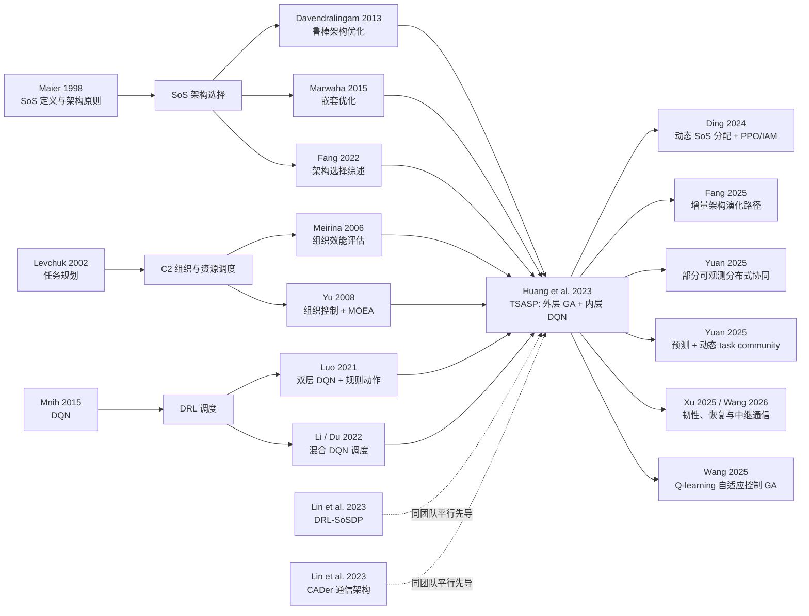

# Huang 等（2023）相关研究脉络：从 SoS 架构选择到学习驱动的动态协同

> 核心论文：Yang Huang, Aimin Luo, Tao Chen, Mengmeng Zhang, Bangbang Ren, Yanjie Song, “When architecture meets RL+EA: A hybrid intelligent optimization approach for selecting combat system-of-systems architecture,” *Advanced Engineering Informatics*, 58, 102209, 2023. DOI: [10.1016/j.aei.2023.102209](https://doi.org/10.1016/j.aei.2023.102209)
>
> 检索截止：2026-08-18。引文关系以论文原文、OpenAlex、ScienceDirect/出版社页面及 DOI 元数据交叉核对。

## 1. 一句话定位

这篇论文的关键贡献不是发明新的 DQN 或遗传算法，而是把原本分开处理的两个 NP-hard 问题——“选哪些组成系统”和“这些系统如何执行任务”——构造成一个双层耦合优化：外层用遗传算法搜索体系架构，内层用离线训练的 DQN 快速生成任务规划，以任务执行效果反向评价架构。

因此，它在研究史上的位置可以概括为：

**SoS 架构组合优化 + C2 任务规划 + DRL 调度规则选择 → 任务导向的架构—规划联合优化。**

## 2. 核心论文究竟做了什么

### 2.1 问题与求解框架

论文提出任务导向的体系架构选择问题 TSASP。架构被简化为传感器（S）、决策者（D）和影响者（I）等组成系统的组合；任务由相互独立的 task 构成，每个 task 又包含按顺序执行的 operations。目标是在架构成本不超过预算的条件下最小化 mission makespan。

整体 CRE 框架由两部分组成：

- 外层 SAEA：染色体编码组成系统是否入选，通过交叉、变异和轮盘赌搜索架构组合。
- 内层 DQN：不直接选择巨大的 operation-system 联合动作，而是在每一步从 5 条可解释的调度规则中选一条，再由确定性的 CSSA 分配具体系统与开始时间。
- 耦合方式：对外层每个候选架构，调用内层规划器得到 makespan，并将其作为架构适应度。

这一设计的实质是**用学习后的快速近似规划器降低外层架构搜索中的适应度评估成本**。

### 2.2 实验结论应如何解读

在 120 个 operations、21 个组成系统的随机场景中，DQN 的平均 makespan 为 509.7–620.4；表 7 中最强的非学习基线均值为 841.8–959.2，按四个实例计算，DQN 的平均 makespan 相对最强对照降低约 30%–43%。外层架构种群在约 124 代后收敛，并在成本约束下给出一个 S/D/I 系统组合。

但这些结果只能支持“在该合成静态场景中，规则选择式 DQN 是较快且有效的内层启发式”，还不足以证明对动态战场、通信受限或系统失效场景的普适优势。

### 2.3 贡献与边界

贡献：

1. 用任务规划的实际结果评价架构，避免仅优化静态能力、连接或鲁棒性指标。
2. 把离线训练、在线快速推断的 DRL 优势嵌入双层组合优化，使联合求解在计算上可行。
3. 用规则作为 DQN 动作，显著压缩动作空间，并保留一定的决策可读性。

主要边界：

1. 架构在一次内层任务规划期间保持静态，尚未实现任务执行过程中的在线架构演化。
2. 假设任务相互独立、不可中断、系统不失效、同能力系统没有性能差异，且所有资源可相互通信。
3. 目标主要是 makespan，成本作为硬约束；韧性、风险、可靠性、通信代价和架构变更代价没有进入统一目标。
4. AMD 案例为随机合成数据；外层缺少强基线、消融和精确小规模最优解对照。论文报告的快速求解主要体现训练后的推断优势，离线训练成本未与传统算法作同口径比较。
5. 表 7 只展示 ABC、ALNS、GA、LS，正文所列 HA1、HA2 未出现在该表中；“规则可解释”也不等于神经网络的选规则原因完全可解释。
6. 正文一处称代码和数据已在 GitHub 提供，文末又称数据可按请求提供，复现信息存在不一致。

## 3. 后向引用：它从哪些研究链条汇合而来

原文有 43 条参考文献，但真正支撑方法结构的“知识主干”约为以下四条。

### 3.1 SoS 概念与架构选择

- Maier（1998）提出 SoS 的操作独立、管理独立、演化发展、涌现行为和地理分布等核心特征，并强调通信标准在 SoS 架构中的基础作用。这是问题域定义的源头。[DOI](https://doi.org/10.1002/(SICI)1520-6858(1998)1:4%3C267::AID-SYS3%3E3.0.CO;2-D)
- Davendralingam 与 DeLaurentis（2013）把相互依赖的组成系统建模为网络节点，用鲁棒混合整数优化处理性能不确定性和级联失效风险，形成“架构选择—能力—成本—不确定性”链条。[DOI](https://doi.org/10.1016/j.procs.2013.01.027)
- Ge 等（2014）把 SoS architecting 表述为交互式 portfolio decision analysis，突出组成系统组合与利益/冲突关系。[DOI](https://doi.org/10.1109/TSMC.2014.2309321)
- Marwaha 与 Kokkolaras（2015）用嵌套分解与直接搜索联合优化航空运输中的多个子系统，是 Huang 双层嵌套结构的直接形式先导。[DOI](https://doi.org/10.1007/s00158-014-1180-1)
- Purohit 与 Madni（2022）用跨层/层内依赖矩阵和随机优化处理模型驱动的架构分解与集成，代表 MBSE/结构依赖路线。[DOI](https://doi.org/10.1109/JSYST.2021.3077351)
- Fang（2022）的综述系统化了 SoS 架构选择的问题、表示、评价与优化机会，是该论文最直接的领域综述入口。[DOI](https://doi.org/10.1109/JSYST.2021.3119294)

这条线解决“架构是什么、如何表示与搜索”，但大多使用静态能力、鲁棒性、连接或成本指标，任务执行计划通常只是外部评价器。

### 3.2 C2 组织设计与任务规划

- Levchuk 等（2002）把 mission planning 作为规范化组织设计问题处理，用多维动态列表调度研究任务—决策者—时间的配置关系。[DOI](https://doi.org/10.1109/TSMCA.2002.802819)
- Meirina 等（2006）进一步用规范模型评估 C2 组织的有效性与效率，把组织、组成系统和任务联系起来。[出版社页面](https://www.sciencedirect.com/science/article/abs/pii/S1569190X0500119X)
- Yu、Tu 与 Pattipati（2008）将 holonic 组织控制架构与多目标进化算法结合，代表“组织结构 + 分布式调度 + EA”的早期融合路线。

这条线提供了 task/operation 的先后序、资源冲突、组织网络与任务效果之间的桥梁。

### 3.3 DRL 调度与规则动作抽象

- Mnih 等（2015）的 DQN 提供经验回放、目标网络与深度价值函数近似的算法基础。[DOI](https://doi.org/10.1038/nature14236)
- Luo、Zhang 与 Fan（2021）提出双层 DQN：上层选择临时优化目标，下层选择调度规则，直接启发了“高层控制 + 低层规则执行”的动作抽象。[DOI](https://doi.org/10.1016/j.cie.2021.107489)
- Li 等（2022）将混合 DQN 用于运输资源不足的动态柔性作业车间，强调离线训练、在线调度与资源约束。[DOI](https://doi.org/10.1016/j.rcim.2021.102283)
- Du 等（2022）把知识规则、DQN 与分布估计算法结合用于多目标柔性作业车间，说明 RL 可以作为混合优化中的策略选择器。[DOI](https://doi.org/10.1109/TETCI.2022.3145706)

Huang 的内层 DQN 并没有学习具体 operation-system 动作，而是学习“在当前调度状态下该使用哪条规则”，其最直接的方法来源就是这条制造调度文献链。

### 3.4 EA 与启发式基线

ABC、ALNS、GA、局部搜索等文献主要承担算法组件或对照组作用；参考文献 26–30 的若干仿生优化论文与 TSASP 的结构关联较弱，更多是一般优化背景，不宜视为研究主干。

## 4. 同团队的平行先导：不能只看原文参考文献

Huang 论文的 43 条参考文献并未纳入两篇同团队、同年发表且高度相关的工作，但构建研究脉络时应把它们视为平行先导：

1. Lin 等（2023）DRL-SoSDP：用 actor–critic 和编码器—解码器直接把系统选择与任务分配转化为节点选择，实现近实时 SoS 设计。它回答“能否让 RL 直接充当架构求解器”。[DOI](https://doi.org/10.1016/j.aei.2023.101965)
2. Lin 等（2023）CADer：用注意力和动态嵌入设计战斗 SoS 的通信架构，回答“能否让 RL 直接设计通信连接”。[DOI](https://doi.org/10.1109/TIV.2023.3236104)

三篇同年工作共同形成一个清晰分工：

- DRL-SoSDP：直接学习系统组合与任务分配；
- CADer：直接学习通信架构；
- Huang CRE：保留 GA 搜架构，用 DQN 加速任务规划评价。

## 5. 前向引用：2023 年之后研究如何使用它

OpenAlex 返回 14 条引文记录，其中一条是 Ding 等论文的 SSRN 预印本，和其 2024 年 *Knowledge-Based Systems* 正式版重复；去重后为 13 项独立工作。ScienceDirect/OUCI 的 cited-by 计数也是 13。下表按与核心问题的关联强弱分类；“高相关”表示延伸了任务导向 SoS 架构、协同或其明确局限，“中相关”表示迁移了分层/混合优化思想，“弱相关”主要是背景性引用。

| 年份 | 直接引用工作 | 关系强度 | 对 Huang 路线的推进或使用 |
|---|---|---:|---|
| 2024 | Ding et al., *System-of-systems approach to spatio-temporal crowdsourcing design using improved PPO algorithm based on an invalid action masking* | 高 | 将 SoS 设计从战斗体系迁移到任务—工人—工作地的动态三元匹配，用 PPO 与无效动作屏蔽直接求解动态分配，推进“动态、大规模、约束动作空间”。[DOI](https://doi.org/10.1016/j.knosys.2024.111381) |
| 2024 | Cao et al., *Local Dimming for Video Based on an Improved Surrogate Model Assisted Evolutionary Algorithm* | 中 | 领域远离 SoS，但采用学习代理模型降低 EA 的适应度评估成本，与 Huang“用学习器加速外层搜索评价”具有共同计算范式。[DOI](https://doi.org/10.1109/TETCI.2024.3370033) |
| 2025 | Wang et al., *An adaptive genetic algorithm based on Q-learning for energy-efficient e-waste disassembly line balancing and rebalancing considering task failures* | 中 | 将 RL+EA 改造成“Q-learning 根据种群状态选择进化策略”，由嵌套求解转向在线自适应控制 EA；同时引入任务失败和再平衡。[DOI](https://doi.org/10.1016/j.jmsy.2025.02.009) |
| 2025 | Khaleel, *Collaborative cloud–edge task scheduling scheme in the networked UAV Internet of Battlefield Things territories based on deep reinforcement learning model* | 中 | 把战场任务规划扩展到 UAV 云—边任务卸载，以时延和可靠性为双目标；重心是资源调度而非 SoS 架构。[DOI](https://doi.org/10.1016/j.comnet.2025.111156) |
| 2025 | Xu et al., *CSoS-STRE: A combat system-of-system space-time resilience enhancement framework* | 高 | 从静态架构效能推进到受损后的时空韧性与恢复顺序，用改进 NSGA-II 联合优化恢复和路径。[DOI](https://doi.org/10.1007/s42524-025-4179-y) |
| 2025 | Yuan et al., *Decentralized coordination of intelligent system of systems under partial observability* | 高 | 同团队延伸；用 MADDPG 在部分可观测、资源有限、通信范围有限条件下构建 task communities，直接放松 Huang 的全局信息与全连通假设。[DOI](https://doi.org/10.1016/j.aei.2025.103286) |
| 2025 | Fang et al., *Architecting Path Selection Method for Incremental Evolution in System-of-Systems* | 高 | 用 PPO 进行多阶段、带不确定性和依赖关系的增量架构路径选择，从“一次选定架构”推进到“选择演化路径”。[DOI](https://doi.org/10.1109/JSYST.2025.3553965) |
| 2025 | Yuan et al., *The benefit of prediction: Enabling collaboration of system of systems with learning* | 高 | 同团队延伸；GRU 预测未来任务状态，DRL 利用预测的全局信息动态组建 task community，推进到未知任务到达下的预测—决策闭环。[DOI](https://doi.org/10.1016/j.eswa.2025.127874) |
| 2025 | Wen et al., *Distributed self-organizing fencing strategy with UAV swarm under incomplete information* | 弱 | 关注 UAV 编队围捕与分布式控制，主要共享“不完全信息下多平台协同”的应用背景，并未继承架构—调度双层优化。[DOI](https://doi.org/10.1016/j.aei.2025.103587) |
| 2025/2026 | Zhang et al., *A belief rule-based system for online and centralized collaborative performance assessment of networked physical systems subject to nonideal channels* | 弱 | 转向非理想信道下的在线协同性能评估，强化了“架构必须由运行效果评价”的思想，但不直接优化架构或任务计划。[DOI](https://doi.org/10.1016/j.eswa.2025.129803) |
| 2026 | Wang et al., *Resilience evaluation and recovery strategy optimization for unmanned system-of-systems considering relay communication* | 高 | 以任务驱动多层网络刻画中继通信增益和任务链依赖，并做双目标恢复优化；从研究问题上直接补上 Huang 明确留下的通信覆盖与韧性缺口。[DOI](https://doi.org/10.1016/j.ress.2026.112444) |
| 2026 | Sun et al., *Integrating FSA and CNN: An architecture for weapon combat effectiveness evaluation in real meteorological environments* | 弱 | 将“统一架构”用于气象条件下的武器效能回归评价，方法是 FSA-CNN；与 TSASP 的关系主要是军事效能评价背景。[DOI](https://doi.org/10.1016/j.aei.2026.104663) |
| 2026 | Li et al., *A hierarchical navigation system for wind-powered USVs...* | 中 | 将传统全局路径搜索与注意力增强 PPO 的局部避障分层组合，体现“不同时间尺度由不同优化器负责”的混合智能思想，但不是 SoS 架构选择。[DOI](https://doi.org/10.1016/j.aei.2026.105024) |

## 6. 研究脉络图

## 7. 从引文网络看到的真正演化方向

### 7.1 从静态“选架构”到动态“走演化路径”

Huang 的外层 GA 在任务执行前选择一个固定组合；Fang（2025）把问题改成跨多个阶段选择架构变化路径，Yuan（2025）则在未知任务到达时动态构建 task community。研究对象正在由静态组合变量转为带切换代价和未来价值的序列决策。

### 7.2 从集中式全信息到部分可观测的分布式协同

Huang 的模型依赖全局任务、资源和可通信信息；后续 MADDPG 工作明确引入局部观测与有限通信。下一步不再只是“换一个更强的 RL 算法”，而是要重新定义观测、通信协议、信息共享代价和去中心化执行可行性。

### 7.3 从单一效率到韧性、风险与恢复

Huang 以 makespan 为中心；CSoS-STRE 和 relay-enabled USoS 将扰动后的性能损失、恢复时间、空间障碍和通信中继纳入评价。架构价值从正常态效率扩展为“受扰—降级—恢复”全过程的任务保持能力。

### 7.4 RL 与 EA 的关系从“上下层分工”转向“互相控制”

Huang 中 RL 是内层求解器、EA 是外层搜索器；Wang（2025）让 Q-learning 直接控制 GA 的进化动作，Cao（2024）用学习代理替代昂贵适应度评价。由此形成三类混合范式：

1. 问题分解型：不同优化器负责不同层级或时间尺度；
2. 算法控制型：RL 在线选择 EA 的算子、参数或搜索策略；
3. 代理评价型：学习模型近似昂贵的仿真/规划适应度。

Huang 属于第 1 类，同时带有第 3 类的雏形。

## 8. 对当前 SOSRL 项目的研究定位

当前仓库的方法是“基于架构规则与调度规则动作抽象的同频双层 DQN”。与 Huang 相比，关键变化是：

| 维度 | Huang CRE | 当前 SOSRL |
|---|---|---|
| 上层决策 | GA 跨种群/代际选择固定架构 | Architecture DQN 每个调度构造步选择 KEEP/ADD/REMOVE/REPLACE 规则 |
| 下层决策 | DQN 选择任务/operation 调度规则 | Scheduler DQN 选择调度规则，CSSA 落到具体 assignment |
| 两层时序 | 外层候选架构 → 完整内层规划 → 返回适应度 | 同一步内先改架构，再排一个 operation，持续交替 |
| 优化对象 | 静态架构下的任务规划效果 | 架构演化轨迹与部分调度轨迹的联合控制 |
| 代价 | 架构总成本硬约束 | 预算、净成本、变更次数等进入奖励/约束 |

因此，最合适的学术表述不是“把 Huang 的 GA 换成 DQN”，而是：

> 将任务导向 SoS 架构选择从“静态架构的嵌套优化”推进为“架构重构与任务调度同频交互的层级序列决策”，并以架构规则和调度规则的双重动作抽象控制联合动作空间。

但这一定位必须正面对比两类近邻：Luo（2021）的双层规则选择 DQN，以及 Fang（2025）的增量 SoS 架构路径 PPO。可形成差异的要点是：

1. 不是上层只选优化目标，而是上层动作会即时改变下层本步的可行系统集合；
2. 不是按阶段选择少量架构节点，而是按 operation 级别把架构变化和调度构造耦合；
3. 显式建模 KEEP/ADD/REMOVE/REPLACE、预算、净成本和架构抖动；
4. 两层都使用可解释规则动作和 action masking，而非直接学习巨大联合动作。

## 9. 建议形成的论文问题链与验证矩阵

建议把后续研究组织成五级问题链：

1. **静态基线**：同频双层 DQN 是否在静态任务上优于 Huang 的“GA + 调度 DQN”？
2. **动态适应**：在任务到达、任务撤销、系统失效或时间窗变化时，在线架构重构是否减少重规划损失？
3. **受限通信**：加入通信拓扑、覆盖范围、带宽和中继后，局部观测策略是否仍能保持任务可行性？
4. **韧性与多目标**：把 makespan、成本、变更代价、性能损失和恢复时间从简单标量化推进到约束 RL 或 Pareto 优化。
5. **泛化与规模**：在未见 task 数、system 数、能力分布和预算上测试零样本/少样本泛化。

最低限度的对照应包括：

- Huang CRE/SAEA-DQN 复现或等价实现；
- 固定架构 + Scheduler DQN；
- Architecture DQN + 固定调度规则；
- flat DQN；
- 当前同频双层 DQN；
- GA/ALNS/规则启发式；
- 小规模精确 MILP/CP-SAT 最优解或最优界。

评价时应把离线训练成本与在线推断成本分开报告，并增加可行率、预算违规、架构变更次数、扰动后恢复时间、跨规模泛化和多随机种子置信区间。消融至少覆盖 action mask、架构规则集、调度规则集、两层交替频率、奖励项和变更代价。

## 10. 结论

Huang 等（2023）最重要的学术作用，是把 SoS 架构选择从“静态结构指标优化”拉到“由任务执行效果驱动的架构优化”，并证明学习型内层求解器可以让双层联合搜索成为现实。其后续研究没有沿单一路线前进，而是分化为动态架构演化、分布式协同、预测驱动、通信与韧性，以及 RL 自适应控制 EA 五个方向。

对当前 SOSRL 而言，最有潜力的主线是：

**Huang 的静态架构—规划嵌套优化 → operation 级同频架构重构—调度协同 → 部分可观测、通信受限、面向韧性的动态 SoS 控制。**

这条线既继承了原论文留下的明确缺口，又能与同团队 DRL-SoSDP、CADer、Yuan 系列和 Fang 的增量架构演化形成可辨认的差异。

